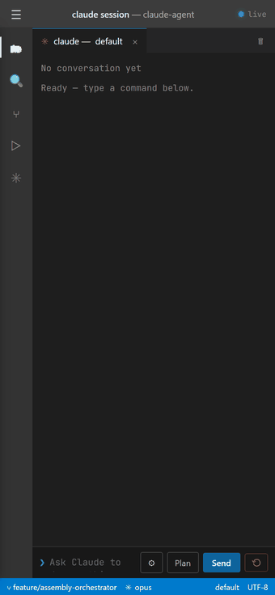

# Claude on your phone

Run Claude Code from your phone. It looks and behaves like a Claude Code
terminal session in VS Code — an Explorer you can slide out, a live-streaming
CLI transcript, model switching, plan mode, and a built-in preview for anything
Claude builds. Your PC does the work; your phone is just the screen.

No API key required — it drives the `claude` CLI signed in with your Claude
Pro/Max subscription.

<p align="center">
  
</p>

<p align="center"><em>Sent from a phone: “build a live clock” → Claude writes the file → it renders in the preview, seconds ticking.</em></p>

---

## What you need

- A Windows PC with **Claude Code** installed and signed in
  (`claude --version` should print a version).
- **Python 3.11+** on that PC.
- A phone on the **same Wi-Fi** as the PC — or **Tailscale** if you want to
  use it away from home (see [Using it away from home](#using-it-away-from-home)).

---

## First-time setup (once)

Open a terminal in this folder and install the dependencies:

```bash
pip install -r claude-agent/requirements.txt
playwright install chromium
```

That's it. You won't need to do this again.

---

## Starting it (every time)

**Double-click `Start-Claude-Agent.bat`.**

A window opens and prints three things:

1. A **QR code**.
2. **Tap-able links** with your access token already built in.
3. Your raw **access token** (a manual fallback, in case you're ever asked to
   type it).

Keep this window open while you use the app. Press **Ctrl+C** in it to stop.

---

## Connecting your phone (no typing)

**Point your phone's camera at the QR code** in the window and tap the link it
shows. That's the whole login — the token is baked into the link, so you never
type anything. Your phone stays signed in after that, even across restarts.

Prefer a link? Tap either printed URL on your phone instead — same result.

> **Why is there a token at all?** So only *your* devices can reach Claude on
> your PC. The QR code and links carry it for you; it's saved in your phone's
> browser after the first connect and scrubbed from the address bar.

---

## Using it away from home

Wi-Fi links only work when your phone and PC share a network. To use the app
from anywhere (mobile data, a café, the office), install **Tailscale** — a free
private network that links your phone and PC directly.

1. Install Tailscale on **both** your PC and your phone, and sign in to the same
   account on each: <https://tailscale.com/download>
2. Start the launcher. If Tailscale is running, it prints an **"Anywhere
   (Tailscale)"** QR/link and makes that the primary connect code — it works at
   home *and* away.

---

## Troubleshooting

| Symptom | Fix |
|---|---|
| `'claude' CLI was not found` | Install Claude Code and run `claude` once to sign in, then relaunch. |
| No QR code appears, only links | Run `pip install qrcode` once. The links still work without it. |
| Phone can't open the Wi-Fi link | Confirm both devices are on the same network, or use the Tailscale link. |
| "Anywhere (Tailscale): not detected" | Start the Tailscale app on your PC, then relaunch. |
| Asked to sign in manually | Paste the access token from the launcher window. |
| Server won't start (port in use) | Another copy is already running — use it, or close it first. |

---

## For developers

The server, API, and architecture are documented in
[`claude-agent/README.md`](claude-agent/README.md). The launcher runs the
server with:

```bash
uvicorn server:app --host 0.0.0.0 --port 8007 --app-dir claude-agent
```
